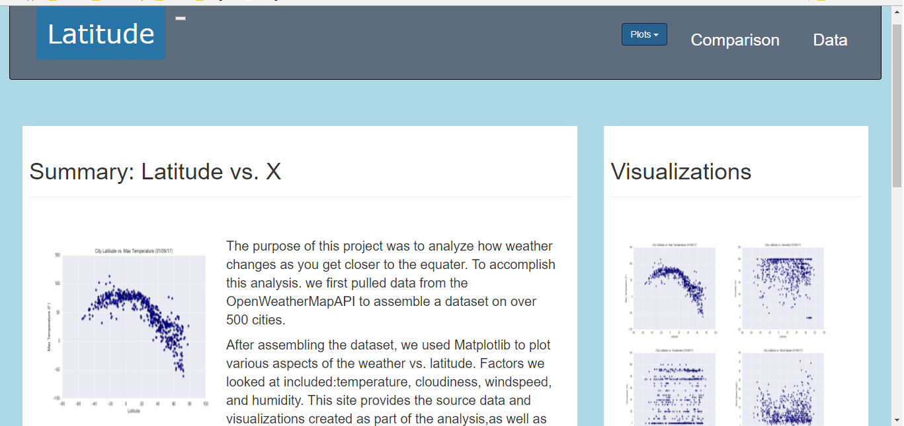

1. The website must consist of 7 pages total, including:

   <1> landing.html:   A landing page containing:
       An explanation of the project.
       Links to each visualizations page.

   <2> visualization-image-1.html,
       visualization-image-2.html, 
       visualization-image-3.html,
       visualization-image-4.html:
        Four visualization pages each with:
        A descriptive title and heading tag.
        The plot/visualization itself for the selected comparison.
        A paragraph describing the plot and its significance.
        
     <3> comparisons.html : A "Comparisons" page that:
        Contains all of the visualizations on the same page so we can easily visually compare them.
        Uses a bootstrap grid for the visualizations.
        The grid must be two visualizations across on screens medium and larger, and 1 across on extra-small and small screens.
        
      <4> data.html:  A "Data" page that:
          Displays a responsive table containing the data used in the visualizations.
          The table must be a bootstrap table component.
                    
2. To Run HTML:

       HTML, style.css, output_data/fig, output_data/cities.csv, assets/css, assets/js

---
    <!DOCTYPE html>
    <html>
      <head>

        <title>Purrfect Match Landing Page</title>
        <!-- Latest compiled and minified CSS -->
        <link rel="stylesheet" href="https://maxcdn.bootstrapcdn.com/bootstrap/3.3.7/css/bootstrap.min.css">
        <!--<link rel="stylesheet" href="griddemo.css">

        <!-- Optional theme -->
        <link rel="stylesheet" href="https://maxcdn.bootstrapcdn.com/bootstrap/3.3.7/css/bootstrap-theme.min.css">
        <link href="https://maxcdn.bootstrapcdn.com/font-awesome/4.7.0/css/font-awesome.min.css" rel="stylesheet">

      </head>

      <body>

        <!-- Latest compiled and minified JavaScript -->
        
            
      </body>
    </html>

